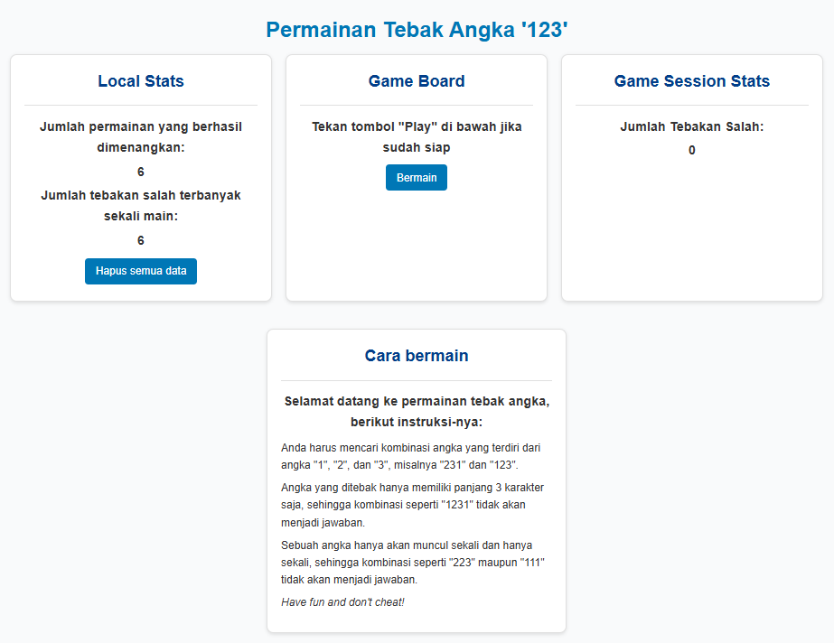

# 🔢 Number Guessing Game

A simple number guessing game to practice and understand the basics of frontend development, specifically the implementation of **sessionStorage** and **localStorage**.

## ✨ Features

- **Dynamic Answer Generation**: Each game session generates a random 3-digit answer.
- **Session Tracking**:
    - Tracks the number of attempts per session.
    - Resets session data when the game ends or the page is refreshed.
- **Persistent Storage**:
    - Saves total victories and maximum attempts across sessions using `localStorage`.
- **Interactive UI**:
    - Displays appropriate messages and stats before, during, and after the game.
    - Provides buttons for user interaction.
- **Data Reset**:
    - Allows users to clear all stored data for a fresh start.

## 📂 Files

### Markup and Styling

- `index.html`: Contains the structure of the game.
- `style.css`: Styles the UI for a simple and clean appearance.

### Script

- `index.js`: Implements game logic and handles interactions with the browser storage.

## 🛠️ How It Works

### Game Flow

1. The player clicks the "Play" button to start the game.
2. A random 3-digit answer is generated and stored in `sessionStorage`.
3. The player guesses the number by clicking buttons (1, 2, or 3).
4. After three inputs:
    - If the guess matches the answer:
        - The game ends.
        - The player's victory count and attempt statistics are updated.
    - If the guess is incorrect:
        - The player is notified of the incorrect guess.
        - The number of attempts is incremented.
5. The player can reset the game or clear all stored data.

### Storage Keys

### Session Storage

- **`SESSION_ANSWER`**: Stores the random answer for the current game session.
- **`SESSION_USER_ATTEMPTS`**: Tracks the number of attempts in the current session.
- **`SESSION_USER_IS_PLAYING`**: Indicates if a game is in progress.

### Local Storage

- **`LOCAL_TOTAL_VICTORIES_PLAYED`**: Keeps a cumulative count of victories across sessions.
- **`LOCAL_MAXIMUM_ATTEMPTS`**: Records the highest number of attempts taken to win a game.

## 🚀 How to Use

1. Open the `index.html` file in your browser.
2. Start a new game by clicking "Play".
3. Guess the number by clicking the buttons labeled 1, 2, and 3.
4. View your stats and reset or clear stored data as needed.

## 📖 Learning Objectives

This project demonstrates:

- The use of **sessionStorage** for temporary, session-specific data.
- The use of **localStorage** for persistent, cross-session data.
- Dynamic DOM manipulation based on user interactions.
- Basic game mechanics implementation in JavaScript.

## 🖼️ Snapshot of the Application in Action

Below is a visual preview of how the application looks and works:

## ⚠️ Notes

- Ensure your browser supports Web Storage (sessionStorage and localStorage).
- Refreshing the page will reset session-specific data but preserve persistent data stored in `localStorage`.

---

Enjoy building and experimenting with this project! 🌟